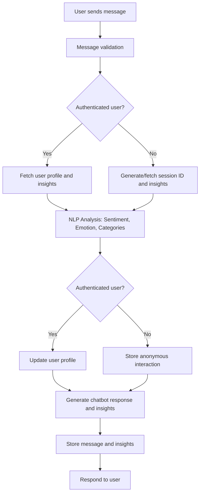

# Project Overview

This project is a Django-based application that integrates two main modules:
1. **Chatbot**: Implements a conversational chatbot with personalized responses and insights.
2. **Accounts**: Manages user authentication and registration.

---

## Folder Structure and Functionality

### **1. Chatbot Folder**
The `chatbot` folder contains all components related to the chatbot functionality.

#### **Key Components**
- `llama.py`:
  - Handles interactions with an external chatbot API hosted locally (`http://localhost:11434/api/chat`).
  - Generates:
    - **Chatbot Responses**: Based on user messages.
    - **Insights**: Statements about the user using past interactions and current input.
  - Categorizes insights into themes like "Productivity," "Health," and "Relationships."

- `views.py`:
  - **ChatbotView**:
    - Processes user messages and performs:
      - Sentiment and emotion analysis using pre-trained NLP models.
      - Updates user profiles with personality traits and interaction patterns.
      - Generates chatbot responses and user insights using the `LLaMA` class.
    - Handles both authenticated and anonymous users.
  - **MessagesView**:
    - Provides an endpoint to retrieve all chatbot messages for authenticated users.

#### **Chatbot Process Flow**
Below is the process flow for the chatbot's functionality:

---

### **2. Accounts Folder**
The `accounts` folder manages user authentication and registration.

#### **Key Components**
- `models.py`:
  - Defines a custom user model (`CustomUser`) extending Django's base user model.
  - Attributes include `username`, `is_active`, and `is_staff`.
  - Managed by `CustomUserManager` for creating users and superusers.

- `serializers.py`:
  - Serializes user data for API communication.
  - Includes the `UserSerializer` for `CustomUser` data (fields: `id`, `username`).

- `views.py`:
  - **RegisterView**:
    - Handles user registration with a unique username and password.
  - **LoginView**:
    - Authenticates users and issues JWT tokens for secure sessions.

---

## Summary of Functionalities

### **Chatbot Module**
- Provides personalized chatbot responses using NLP capabilities.
- Updates user profiles with insights, sentiment, and emotion data.
- Supports both authenticated and anonymous users.
- Categorizes user insights into themes like "Productivity" and "Health."

### **Accounts Module**
- Manages user registration and authentication.
- Implements a custom user model with extended attributes.
- Serializes user data for API interactions.
- Issues JWT tokens for secure user sessions.

---

## How to Use

1. **Run the Application**:
   - Start the Django server: `python manage.py runserver`.
   - Ensure the external chatbot API (`LLaMA`) is running at `http://localhost:11434`.

2. **Endpoints**:
   - **Chatbot**:
     - POST `/chatbot/`: Send user messages and receive chatbot responses.
     - GET `/chatbot/messages/`: Retrieve all chatbot messages (authenticated users only).
   - **Accounts**:
     - POST `/accounts/register/`: Register a new user.
     - POST `/accounts/login/`: Authenticate a user and retrieve JWT tokens.

---

## Future Enhancements
- Add more NLP models for enhanced emotion and sentiment analysis.
- Expand the chatbot's ability to handle complex queries and provide detailed responses.
- Integrate more themes for categorizing user insights.